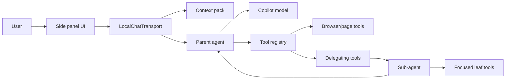
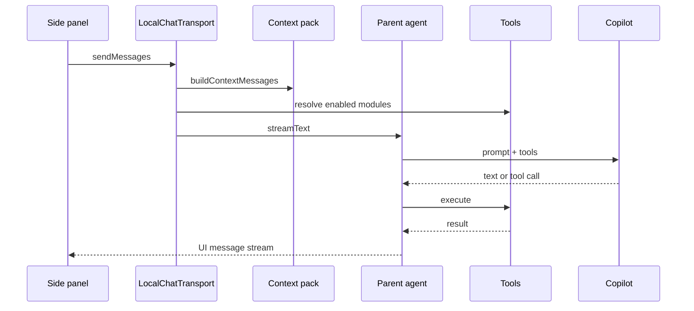
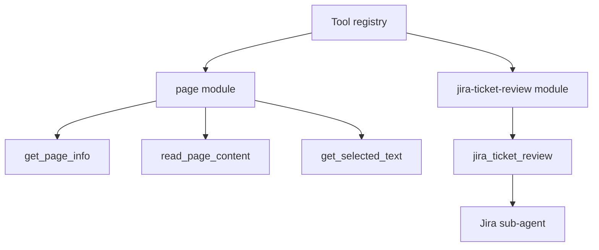
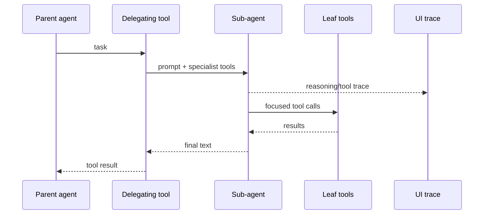
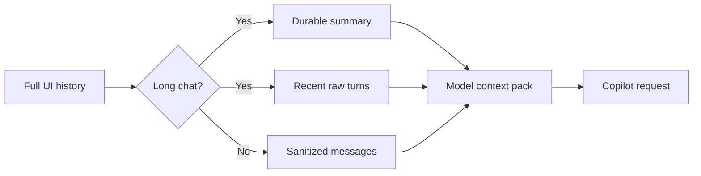

# Parent/Sub-Agent Architecture

This document covers the AI agent hierarchy and context flow. Browser execution
is a separate shared subsystem used by the embedded agent and external MCP
clients; its canonical design is
[Browser-control architecture](BROWSER_CONTROL_ARCHITECTURE.md).

This extension runs its AI agent loop entirely inside the Chrome side panel.
The MV3 background worker opens the panel; it does not broker chat requests.

## Runtime Shape

The parent agent is the main `streamText` loop in `lib/chat/transport.ts`.
It receives compacted model messages, resolved tools, and the selected Copilot
model. Tool execution happens in the same side-panel page, so tools can use
Chrome extension APIs directly.

## Parent Loop

The parent owns conversation continuity, top-level tool choice, and final user
responses. It should keep broad context and delegate narrow, repeatable work to
sub-agents when a specialist loop would be cleaner than one large prompt.

### Page Freshness

Page observations from earlier turns are historical context, not current page
state. Before answering a question that could depend on the current page or
visible UI, the parent must inspect the page in the same turn: use
`take_snapshot` for dynamic or interactive UI and `read_page_content` for
document or article content. It must inspect again after navigation, browser
actions, user interaction, or any possible page update; if inspection is
unavailable, it should say so rather than guess.

## Tool Modules

Tools are grouped as `ToolModule`s in `lib/tools/`. Each module can:

- expose one or more AI SDK tools,
- gate itself with `isAvailable`, and
- receive a shared `ToolContext`.

`ToolContext` gives tools the active tab, the selected language model, and a
sub-agent trace emitter. The registry resolves only enabled and available
modules before each parent run.

## Sub-Agents

Sub-agents are implemented with `defineSubagent` in `lib/agents/subagent.ts`.
A delegating tool accepts a self-contained `task`, creates a child
`ToolLoopAgent`, and returns the child's final text as the tool result.

Sub-agents reuse the parent model through `ctx.getModel()`, but they do not see
the full chat history. The parent must pass everything the child needs in the
delegated `task`. The child streams a compact trace back to the UI as
`data-subagent` parts so nested work is visible without polluting future model
context.

## Context Management

The UI keeps the full session history, but the model receives a bounded context
pack from `lib/chat/context-pack.ts`.

Current behavior:

- Short chats are sanitized and sent as-is.
- Longer chats compact older turns into a durable summary and keep the most
  recent raw turns.
- Summaries are stored per session in IndexedDB. The compacted boundary advances
  in batches, so the cacheable summary prefix remains stable across several
  sends before another batch of raw tail messages is folded in.
- Reasoning, step markers, UI data parts, and oversized tool payloads are
  removed or reduced before they reach the model.
- If exact page or tool data is needed after compaction, the agent should call
  the relevant tool again.

## Caching

There are two cache layers:

- Copilot request shaping marks stable prefix messages, including the system
  prompt and generated context pack, so compatible models can reuse prompt cache.
- Browser read tools use short TTL caches for expensive nullary reads such as
  page extraction and Jira issue scraping.

Cache behavior should remain observable through usage logging and live probes.
When changing model calls, tool execution, compaction, or request transforms,
validate with the real Copilot API and the live extension flow.
Development builds also log `[context-pack]` with whether the summary was reused
or refreshed, the folded-message count, and the active compacted boundary.

## Extension Guidelines

- Add broad capabilities as tool modules.
- Add focused, multi-step specialist work as sub-agents.
- Keep child prompts self-contained; do not assume the child can infer parent
  chat history.
- Prefer re-reading dynamic browser state through tools over preserving large
  raw tool outputs in context.
- Update this document when agent orchestration, tools, sub-agents, or context
  management changes.
