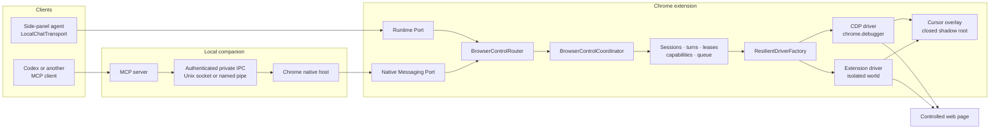
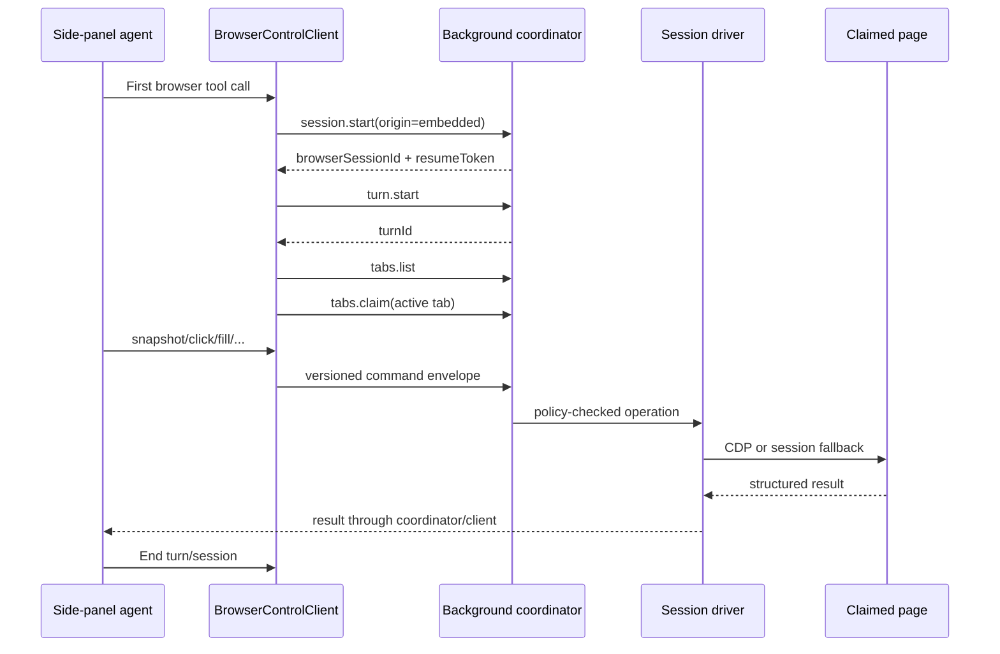
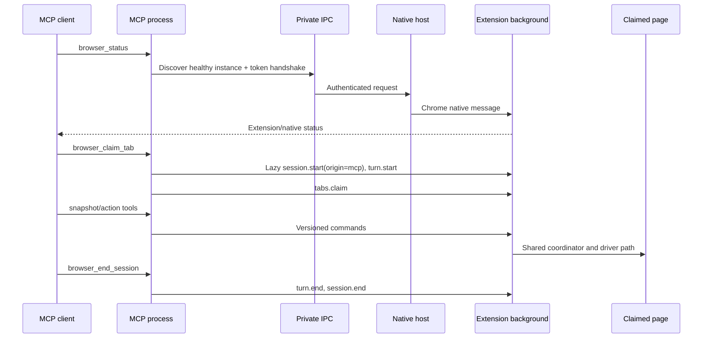
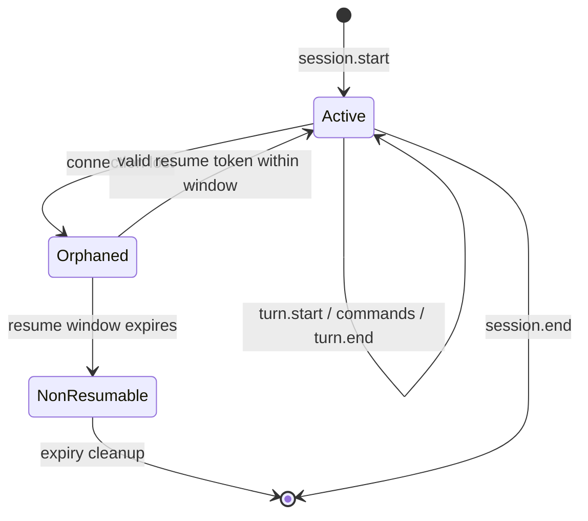

# Browser-control architecture

This document is the canonical technical design for AI Page Chat browser
control. It describes the implemented system shared by the in-extension agent
and external MCP clients.

For installation and operator-facing validation, see
[Dual-client browser control](DUAL_CLIENT_BROWSER_CONTROL.md). For the original,
pre-CDP design proposal, see [Browser Control Plan](BROWSER_CONTROL_PLAN.md);
that plan is historical and is not the current architecture.

## Goals and invariants

The system has five non-negotiable properties:

1. **One authority, two clients.** The side-panel agent and external MCP clients
   enter the same coordinator. Neither client owns a separate privileged driver.
2. **Explicit ownership.** Browser sessions own turns, turns issue commands, and
   sessions must lease tabs before controlling them.
3. **CDP first, bounded fallback.** Chrome DevTools Protocol supplies
   deterministic snapshots and trusted input. If Chrome rejects or forcibly
   detaches the debugger, only the affected browser session switches to the
   isolated-world extension driver.
4. **Visible actions.** Both driver paths publish the targeted element to the
   on-page cursor. CDP uses the final input coordinate; fallback is best-effort
   if its later action injection scrolls or moves the element.
5. **Policy at the authority boundary.** Protocol validation, host permissions,
   restricted URLs, leases, payload limits, and command
   serialization are enforced after transport convergence and before page
   execution.

## System context



The AI loop remains entirely inside the side panel for embedded chat. The
native companion contains transport and MCP adaptation only; it does not contain
an agent loop, page policy, or browser driver.

## Layer boundaries

| Layer | Responsibility | Primary implementation |
|---|---|---|
| Model-facing tools | Preserve the existing `BrowserDriver` tool contract | `lib/agent-tools/browser-control/module.ts`, `tools/` |
| Embedded client | Convert driver calls into versioned runtime requests; own embedded session/turn lifecycle | `client/client-driver.ts`, `client/runtime-client.ts` |
| MCP adapter | Expose 18 MCP tools; lazily own an MCP session and turn | `packages/browser-bridge/src/mcp/` |
| Transports | Carry validated envelopes without adding browser authority | `background/connection.ts`, `background/native-connection.ts`, `packages/browser-bridge/src/` |
| Protocol router | Reject malformed or version-mismatched envelopes | `background/router.ts`, `packages/browser-control-protocol/` |
| Coordinator | Apply lifecycle, ownership, policy, and per-tab serialization | `background/coordinator.ts` |
| Driver seam | Provide a session-bound browser implementation | `driver/types.ts`, `driver/resilient-driver.ts` |
| CDP engine | Attach, snapshot, resolve references, dispatch trusted input, navigate, wait, and capture | `driver/cdp/` |
| Fallback engine | Continue the affected session through `chrome.scripting` isolated-world calls | `driver/extension/` |
| Cursor | Deliver and render visual targeting feedback | `background/cursor-*`, `overlay/`, `entrypoints/browser-control-overlay.ts` |

Tools do not call `chrome.*` directly. They call `BrowserDriver`; the
`ClientDriver` sends protocol commands to the coordinator, which obtains a
session-bound driver view.

## Client paths

### Embedded side-panel path



Browser control defaults to enabled for new chat sessions. The migration keeps
an explicit legacy opt-out. The embedded client automatically claims the active
tab at turn start because the existing model-facing tools begin with a snapshot
rather than an explicit claim call.

The runtime client keeps the plaintext resume token in the side-panel process.
If its port disconnects, it attempts to retry only idempotent commands after a
successful session resume. Mutating actions are never blindly replayed. See
[Known boundaries](#known-boundaries) for the current turn-recovery limitation.

### External MCP path



`browser_status` does not create a browser session. The first other MCP tool
lazily starts one session and one turn. Unlike the embedded client, MCP callers
must explicitly claim a tab before page control. Closing the MCP transport
normally ends its session. The MCP process also handles `SIGTERM` and `SIGINT`
by awaiting `turn.end` and `session.end` before exiting, so an ordinary client
shutdown releases the lease before a later embedded chat starts. Losing the
shared native connection still causes the coordinator to orphan its sessions
and driver attachments; see [Known boundaries](#known-boundaries).

The MCP surface intentionally excludes `page.evaluate` and raw `cdp.execute`.
External clients receive the bounded browser tool set, not arbitrary script or
debugger execution.

## Protocol

The shared package `@ai-page-chat/browser-control-protocol` defines strict Zod
schemas for requests, responses, commands, errors, and cursor
messages.

Every request contains:

| Field | Meaning |
|---|---|
| `protocolVersion` | Currently literal version `1` |
| `requestId` | Correlates one request, progress stream, and response |
| `browserSessionId` | Required after session creation |
| `turnId` | Required for controlled commands inside a turn |
| `tabId` | Optional explicit target; lease checks still apply |
| `deadlineMs` | Optional caller deadline |
| `command` | Strict discriminated command object |

The router validates at both runtime and native-message boundaries. Unknown
fields, invalid command combinations, and version mismatches do not reach the
coordinator.

Command groups are:

- lifecycle: `session.*`, `turn.*`, `browser.status`
- tabs: list, claim, release, select, create, close
- page reads: info, snapshot, screenshot, wait
- navigation: navigate and back/forward history
- actions: click, hover, fill/select, key, scroll, and a maximum 20-operation
  ordered batch
- internal/reserved: cursor messages, evaluate, and raw CDP

Only status, tab listing, snapshot, screenshot, and page information are
classified as idempotent for reconnect behavior.

## Session, turn, and tab ownership



- Session records live in `chrome.storage.session`, allowing metadata to
  survive an MV3 worker restart without syncing it to another browser.
- Resume tokens contain 32 random bytes. Only their SHA-256 hashes are stored;
  plaintext remains in the client process.
- Embedded sessions have a 15-second orphan resume window. MCP sessions have a
  30-second window.
- A connection may act only on its active session, and a command may act only
  during an active turn.
- A tab has at most one lease owner. A conflicting claim returns `TAB_LEASED`;
  it never silently steals control.
- An embedded reload may replace its own orphaned embedded lease because the
  side panel loses its in-memory token. The protocol requires MCP callers to
  resume using their token, but the current MCP adapter does not implement that
  path.
- Creating a tab and leasing it is atomic. If lease acquisition fails, the
  newly created tab is closed.
- Commands for the same tab run through `TabQueue`, preventing interleaved
  actions. CDP attach/detach operations are also serialized per tab so a late
  disposal cannot detach a replacement session.

## Driver architecture

### CDP primary

The CDP driver uses `chrome.debugger` as the supported Chrome extension entry
point. It attaches to the root page target, enables Page and Runtime domains,
restores input delivery, and enables focus emulation.

Its main subsystems are:

- `AttachmentManager`: reference-counted root attachments, child iframe
  sessions, per-tab attach/detach serialization, and cleanup.
- `SnapshotEngine`: combines accessibility and DOM information into compact
  interactive or full snapshots.
- `NodeReferenceRegistry`: issues opaque references bound to browser session,
  tab, document revision, frame, and backend node.
- `TargetResolver`: resolves a reference, current geometry, occlusion, and
  iframe coordinate mapping immediately before an action.
- `CdpInput`: dispatches trusted pointer and keyboard events.
- `CdpNavigation` and `CdpWaiter`: event-aware navigation settlement and bounded
  selector/text waits.
- `CdpScreenshots`: bounded JPEG capture.

The driver watches `DOM.documentUpdated`, `Page.frameNavigated`, and
`Page.navigatedWithinDocument` to advance a tab's document revision. References
from an earlier session, tab, or revision fail rather than target a potentially
different element.

Child iframe targets are optional. The attachment manager initializes only
ordinary web targets; restricted or unidentified extension frames are skipped
so a password-manager frame cannot take down root-page control.

### Session-scoped fallback

Chrome can still forcibly detach `chrome.debugger`, particularly when another
extension exposes a protected frame. `ResilientDriverFactory` handles this
without globally degrading browser control:

1. The affected operation reports debugger unavailability.
2. The factory selects the same target tab in a fallback driver created only
   for that browser session.
3. Safe reads/navigation may retry through fallback.
4. A reference action is not replayed. It returns an instruction to take a new
   snapshot because CDP and fallback references belong to different epochs.
5. The session remains on fallback until it ends. A new session tries CDP
   again.

Fallback isolation is important: its DOM-reference map, target tab, turn ID,
cursor sequencing, and screenshot budget must not leak between embedded and
MCP clients.

### Post-action and payload behavior

- Actions return the current URL/title and whether navigation occurred so the
  agent can often avoid a redundant snapshot.
- Ordered action batches stop on the first failure or navigation.
- Screenshots use JPEG quality 60, retry once at half scale if necessary, and
  are limited to one successful screenshot per browser turn.
- Snapshot text is capped at 256 KiB. Raw screenshots are capped at 5 MiB and
  their base64 representation at 7 MiB. Private IPC frames are capped at 8 MiB.

## Visible cursor

The cursor is an observability contract, not a decorative animation.

```mermaid
sequenceDiagram
  participant Driver as CDP/fallback driver
  participant State as CursorState
  participant Script as Overlay script
  participant View as Closed-shadow cursor
  participant Input as Page input

  Driver->>Driver: Resolve top-level target center
  Driver->>State: cursor.move(session, turn, sequence, x, y, pulse)
  State->>Script: tabs.sendMessage
  Note over State,Script: Inject overlay lazily if absent
  Script->>View: Animate or move immediately
  Script-->>State: cursor.arrived
  State-->>Driver: arrived / hidden / timed-out / unavailable
  Driver->>Input: CDP uses same coordinate; fallback re-resolves before action
```

- The overlay is an unlisted isolated-world script injected only into a
  controlled page when needed.
- The host covers the viewport, has `pointer-events: none`, uses a closed shadow
  root, and is marked `aria-hidden`, so it cannot capture clicks or pollute page
  accessibility.
- Movement is keyed by session ID, turn ID, and monotonic move sequence.
- Reduced-motion preferences produce an immediate move instead of animation.
- Clicks request a short pulse at the target.
- The driver waits at most 900 ms for visual arrival. Hidden tabs return
  immediately, and missing/invalidated overlays never block the actual action
  forever.
- The inert host exposes only rendered X/Y data attributes for live alignment
  auditing.

CDP publishes the resolved top-level coordinate that its input path uses. For
iframe targets, child-frame geometry is projected through each frame owner into
the top-level viewport before cursor publication. The fallback path publishes
the element center from a preliminary injection, then performs the action in a
second injection that may scroll and recompute geometry. Its cursor is therefore
best-effort and can drift from the final synthetic-event point when scrolling
occurs; see [Known boundaries](#known-boundaries).

## Action and safety model

Safety is layered:

1. Browser-internal pages and the Chrome Web Store are restricted.
2. The extension must hold host permission for the target origin.
3. The caller must own an active session, turn, and tab lease.
4. Advanced evaluation is disabled in the production coordinator.
5. Once browser control is enabled for a client, claimed-tab actions execute
   without a per-action approval dialog.

The browser-control flag is the explicit authorization boundary. It does not
remove the restricted-URL, host-permission, session, turn, tab-lease, or
advanced-evaluation constraints above.

## Native companion and MCP boundary

Chrome starts the allowlisted native host through `nativeMessaging`. The host:

1. creates a random instance ID and 32-byte token;
2. binds a user-local Unix socket or Windows named pipe;
3. writes a 0600 registry entry under a 0700 directory;
4. heartbeats every 10 seconds;
5. sends `ready` only after the socket and registry are usable; and
6. unregisters and closes pending requests on disconnect.

Healthy registry entries are at most 30 seconds old. With no explicit instance
selection, discovery fails closed when zero or multiple healthy instances are
present. macOS uses a short per-user directory under `/tmp` to remain below the
AF_UNIX path limit; the directory itself remains mode 0700.

The IPC server requires the registry token and matching protocol version before
accepting requests. It opens no TCP listener. Native requests entering the
extension are capped at 256 KiB.

The installer:

- copies the compiled bridge rather than referring to the source checkout;
- rejects unsafe absolute or parent-relative runtime paths;
- writes 0700 native-host and MCP launchers on Unix;
- writes a Chrome native-host manifest allowlisted to one exact extension ID;
  and
- prints the MCP client configuration snippet.

The installer deliberately has no automatic delete/uninstall operation.

## Failure and recovery behavior

| Failure | System response | Caller recovery |
|---|---|---|
| Embedded runtime connection lost | Orphan session and lease; release driver attachment | Resume where supported or start a fresh embedded session, which may replace its own orphaned embedded lease |
| MCP stdio closes or receives SIGTERM/SIGINT | Await turn/session cleanup, release leases, then exit | No manual recovery required |
| Shared native connection lost | Orphan MCP sessions and leases; release driver attachments | Reload the extension before reclaiming an orphaned MCP tab; current MCP clients do not resume and orphan expiry is not wired |
| Native host missing/offline | Embedded control continues; external status becomes offline and reconnect backs off from 500 ms to 10 s | Install/restart companion or disable external control |
| Protocol mismatch | Reject before coordinator dispatch | Upgrade extension and companion together |
| Tab owned elsewhere | Return `TAB_LEASED` with owner origin | Choose another tab or wait for release |
| Navigation/document update | Advance document revision | Take a fresh snapshot |
| Debugger rejected/detached | Activate fallback only for that session | Take a fresh snapshot before another reference action |
| Cursor hidden/missing | Return hidden, timeout, or unavailable cursor status without blocking forever | Action continues; inspect overlay/permissions if visibility is required |
| Tab-close action | Close the caller's claimed tab | Claim the intended tab before closing it |
| Oversized payload | Reject or downscale within configured caps | Use snapshot/direct tools or reduce captured content |
| Extension reload | Native host unregisters; stale pending requests fail | Reconnect and establish a fresh session and turn |

`RecoveryManager` defines the worker-restart policy of marking recovered
ownership orphaned before reuse. It is currently an integration hook and is not
wired in `entrypoints/background.ts`; future service-worker recovery work must
wire and test it rather than assuming constructor presence activates recovery.

## Known boundaries

These are current implementation limits, not supported recovery guarantees:

- `RecoveryManager` and orphan expiry exist as tested components but are not
  composed into `entrypoints/background.ts`. An MV3 service-worker restart loses
  the in-memory turn table and lease table while persisted session metadata
  remains. Clients should establish a fresh browser session after a worker
  restart; full transparent resume requires wiring recovery and rebuilding a
  valid turn.
- A normal MCP stdio close and catchable `SIGTERM`/`SIGINT` await
  `session.close()` and release the turn, session, and lease. An uncatchable
  `SIGKILL` or process crash can still bypass cleanup while the shared native
  host remains connected. Crash-proof cleanup for that case requires
  associating each IPC socket closure with the sessions created through it.
- When the shared native connection disappears, the coordinator marks its MCP
  leases orphaned but does not delete them. The lease store intentionally
  rejects replacement of an orphaned MCP lease, expiry is not scheduled, and
  `McpBrowserSession` does not implement `session.resume`. The affected tab can
  remain blocked until extension/background state is restarted.
- Fallback cursor location and fallback action execute in separate script
  injections. The action may call `scrollIntoView` after the cursor coordinate
  was measured, so exact cursor-to-input alignment is guaranteed only on CDP
  and on fallback actions whose geometry does not move between injections.
- `page.evaluate` and raw `cdp.execute` are deliberately disabled rather than
  partially supported. Enabling either requires a separate advanced-capability
  design and must not be inferred from their reserved protocol schemas.
- `browser_scroll` currently requires an element reference in the shared driver
  adapter. A reference-free page scroll request returns a structured driver
  error.

## Configuration and permissions

- New embedded chat sessions default browser control to **on**.
- External MCP control defaults to **on** until the user explicitly configures
  it off. The configured marker distinguishes a real opt-out from the old
  default-off value.
- Changing the external setting refreshes the native connection immediately and
  also sends a runtime message so a cold MV3 worker cannot miss the storage
  event.
- Required extension permissions are `debugger` and `nativeMessaging`, plus
  host access for the controlled site.
- Chrome displays its normal debugging indicator while CDP is attached.

The settings toggle changes reachability; it does not grant host permissions,
transfer a tab lease, or enable arbitrary evaluation.

## MCP tool surface

The companion exposes exactly 18 tools:

| Category | Tools |
|---|---|
| Status/session | `browser_status`, `browser_end_session` |
| Tabs | `browser_list_tabs`, `browser_claim_tab`, `browser_release_tab`, `browser_new_tab`, `browser_close_tab` |
| Read/navigation | `browser_navigate`, `browser_snapshot`, `browser_screenshot`, `browser_wait` |
| Actions | `browser_click`, `browser_hover`, `browser_fill`, `browser_select`, `browser_press_key`, `browser_scroll`, `browser_act_batch` |

References accepted by action tools are opaque values from the latest valid
snapshot. A caller must not parse, cache across navigation, or synthesize them.

## Extending the system

### Add a protocol command

1. Add the strict command schema and types in
   `packages/browser-control-protocol/src/`.
2. Decide identifier requirements in `BrowserControlRequestSchema`.
3. Route and authorize it in `BrowserControlCoordinator`.
4. Add or extend the `BrowserDriver` seam only if the operation is genuinely a
   driver responsibility.
5. Implement both CDP behavior and an explicit fallback behavior or error.
6. If external, map it to a bounded MCP tool and input schema.
7. Add protocol, coordinator, driver, transport, and live-flow tests.
8. Update this document and the operator guide.

### Add a transport

A new client transport must:

- create an immutable connection context with origin and capabilities;
- validate with `BrowserControlRouter`;
- forward disconnect to `BrowserControlCoordinator.disconnect`;
- preserve request IDs and versioned envelopes; and
- avoid implementing independent leases or driver access.

### Change cursor behavior

Keep cursor identity and sequence fields intact, preserve
`pointer-events: none`, honor reduced motion, and retain bounded arrival
waiting. CDP changes must keep the rendered cursor and final input geometry
identical. Fallback changes must either preserve the current preliminary-center
contract or deliberately combine location and action into one geometry-stable
operation before claiming exact alignment.

## Source map

```text
entrypoints/
  background.ts                         composition root
  browser-control-overlay.ts            injected cursor entrypoint
lib/agent-tools/browser-control/
  background/                            coordinator, leases, queue, and native transport
  client/                                embedded runtime client adapter
  driver/types.ts                        browser driver seam
  driver/cdp/                            primary CDP implementation
  driver/extension/                      isolated-world fallback
  driver/resilient-driver.ts             per-session failover
  overlay/                               cursor controller/path/view
  tools/                                 model-facing browser tools
  settings.ts                            external-control setting/migration

packages/
  browser-control-protocol/              shared versioned schemas
  browser-bridge/
    src/mcp/                              MCP server, tools, lifecycle
    src/native/                           native host and framing
    src/ipc/                              registry, authentication, IPC
    dist/                                 self-contained install artifact
```

## Verification contract

Architecture changes are complete only when all applicable layers pass:

```sh
pnpm test:unit
pnpm compile
pnpm build
pnpm --filter @ai-page-chat/browser-bridge test
pnpm --filter @ai-page-chat/browser-bridge build
```

Then validate both real client paths:

- run all embedded scenarios with `node test/browser-control/run.mjs`;
- run `node scripts/mcp-smoke.mjs` through the installed companion;
- verify normal MCP transport-close cleanup by immediately starting embedded
  control;
- compare cursor host X/Y to the controlled target center on CDP and forced
  fallback pages; and
- reload the extension and confirm its `chrome://extensions` Errors view
  remains empty after exercised control.

The detailed setup and commands live in [Testing](TESTING.md) and
[Dual-client browser control](DUAL_CLIENT_BROWSER_CONTROL.md).
