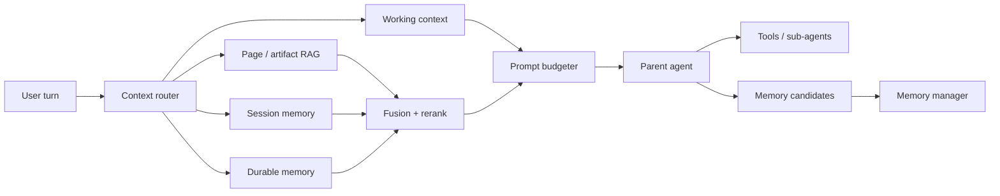
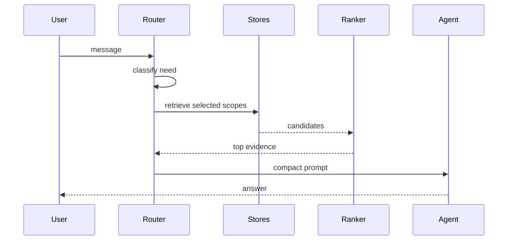
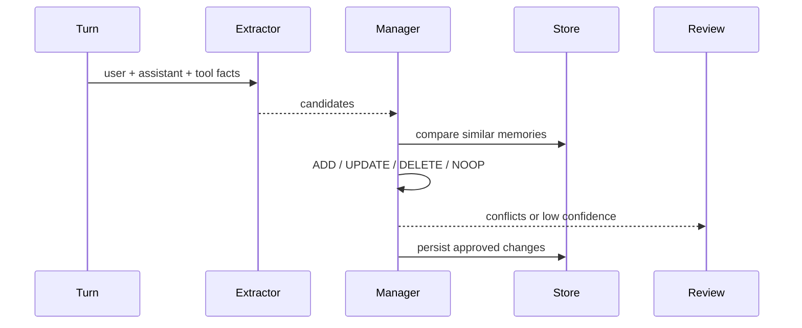

# Context and Memory Plan

Updated: 2026-06-18

This plan upgrades the extension from "bounded recent chat + page tools" into a
hybrid context and memory system that can scale to parent agents, sub-agents,
multi-agent workflows, browser artifacts, and durable user/project memory.

The core idea: **context is what the model needs now; memory is what the system
chooses to preserve, manage, retrieve, and eventually forget.** Treat them as
related but separate systems.

## Design Thesis

The strongest 2026 pattern is not "send more context." It is:

1. Keep the hot context compact.
2. Retrieve exact evidence with hybrid search.
3. Use structured, scoped memory for durable facts.
4. Gate retrieval and memory reads so they happen only when useful.
5. Measure every tier before adding the next one.

This keeps latency and token spend under control while still giving agents the
information they need.

## Ownership Model

This plan is split into two responsibility domains so agents do not drift into
each other's work.

| Domain | Owner/model | Scope | Hard restriction |
|---|---|---|---|
| Extension-side | Codex / GPT-5.5 via the `cod`/Codex workflow | Local agent engine, RAG, memory schemas, storage, WebGPU workers, retrieval, Copilot calls, tool/sub-agent management, eval harnesses, MV3 permissions, migrations | Do not build UI components, CSS, settings screens, or visual review flows for this plan |
| UI | Claude / project-configured Claude model | React display components, settings pages, user-facing controls, review/purge screens, status indicators, copy, and layout | Do not change RAG, memory, storage semantics, Copilot/provider logic, tools, sub-agent execution, WebGPU, or eval engines |

The boundary is API-shaped: extension-side work owns data contracts and
behavior; UI work consumes those contracts and renders controls around them. If
a change needs both domains, split it into two tasks with an explicit handoff.

## Feature Flag - `rag`

Everything in this plan ships behind a feature flag named `rag`.

- When `rag` is off, the current/basic prompt processing pipeline stays intact:
  no retrieval, durable-memory lookup/write, contextual indexing, rerank, or
  cross-page memory participates in prompt construction for that session.
- When `rag` is on for the current session, the prompt pipeline may use the
  RAG/context-memory path according to the roadmap gates and available user
  settings.
- Extension-side owns the session-level flag contract and enforcement in the
  prompt processing pipeline.
- UI owns a clear chat-window toggle that turns `rag` on or off for the current
  session without redefining retrieval, memory, storage, or provider semantics.

## Target Architecture



## Memory Layers

| Layer | Purpose | Storage | Prompt policy |
|---|---|---|---|
| Working context | Current turn, recent raw chat, compacted summary | session IndexedDB | always bounded |
| Page/artifact RAG | Current page chunks, tool outputs, anchors | page index + tool cache | retrieved as evidence |
| Session memory | Decisions, open questions, important temporary state | session memory store | retrieved by session scope |
| Durable memory | Stable user/project facts, preferences, conventions | scoped memory store | retrieved only when relevant |
| Procedural memory | Reusable workflows and agent instructions | docs / skills | referenced, not bulk injected |

Durable memory must have provenance, scope, confidence, timestamps, and review
state. It should never become a raw transcript archive.

## Read Path



The router chooses from `{none, page, session, durable, all}` and assigns a
token budget. The first implementation can use a cheap utility-model classifier
plus deterministic heuristics. TARG-style uncertainty gating is useful
inspiration, but Copilot likely does not expose logits, so do not depend on
true logit-margin gating.

## Write Path



The write path is separate from the response path when possible. It can run
after the answer, or behind an explicit user-approved memory setting.

Memory operations:

- `ADD`: new durable fact or preference.
- `UPDATE`: improves or supersedes an existing memory.
- `DELETE`: removes stale or contradicted memory.
- `NOOP`: candidate is transient, duplicate, unsafe, or obvious from code/page.

## Current Foundation

Already built or planned in the current extension:

- `context-pack.ts`: compact old chat into a durable session summary, keep
  recent raw turns, and advance the summary checkpoint in batches so the
  cacheable prefix stays stable across several sends.
- `context-db.ts`: persist per-session compaction state.
- `model-selection.ts`: use an economical utility model for compaction/titling.
- `tool-cache.ts`: short-lived cache for expensive browser reads.
- Copilot request shaping: stable prefixes can benefit from provider prompt
  caching when supported.

This is a good short-term context foundation. The next work should add the
retrieval and durable-memory layers without bloating the hot prompt.

## Recommended Stack

| Layer | Pick | Notes |
|---|---|---|
| Embeddings runtime | `@huggingface/transformers` v4, pinned exact | Web Worker in side panel; WebGPU with WASM fallback |
| Embedding model | `bge-small-en-v1.5` q8, 384 dim | small enough for browser; upgrade path to EmbeddingGemma |
| Hybrid search | Orama hybrid search + IndexedDB persistence | BM25 + vector search in browser |
| Fusion | RRF or Orama hybrid defaults | avoids dense/BM25 score mismatch |
| Rerank | optional MiniLM cross-encoder or utility-LLM listwise rerank | only keep if evals show lift |
| Contextual indexing | utility LLM writes short chunk context before indexing | high value for detached chunks |
| Durable memory | structured memory records + hybrid retrieval | scoped by user/project/origin/account |

## Roadmap - Extension-Side

Owner: **Codex / GPT-5.5 via the `cod`/Codex workflow**.

This lane owns the local engine of the extension: RAG logic, WebGPU,
embedding/index workers, storage schemas, memory management, Copilot/model
calls, agent routing, sub-agent capabilities, tool APIs, evaluation harnesses,
and MV3 implementation constraints.

Codex must not implement user-facing React components, CSS, settings pages, or
visual memory-review/purge flows for this plan. It may define typed APIs,
events, settings contracts, and storage behavior that UI will consume.

### E0 - Interfaces, Governance, And Eval Ruler

Build the interfaces before the retrieval engine:

- Define the `rag` feature flag contract and session-level prompt-pipeline gate.
- `retrieveContext(query, options)` returns bounded evidence snippets with
  source, scope, anchors/selectors, and trust metadata.
- `writeMemoryCandidate(candidate)` records reviewed or pending memory updates.
- `getRuntimeMemory(query, scope)` returns compact durable memory for prompt use.

Create a small eval suite:

- 20-40 Jira/Confluence/page queries with expected chunks.
- Include Jira URL detection cases for both Atlassian Cloud
  (`*.atlassian.net`) and self-hosted/custom Jira installs. Many companies run
  Jira on internal domains, so detection should also treat domains or
  subdomains containing `jira` as likely Jira candidates. For custom domains,
  confirm once with page structure/tool probes and persist approval for that
  origin/account so Jira-specific behavior does not re-prompt or re-prove on
  every visit. Provide revoke/reset controls for incorrect approvals.
- 20 memory questions covering single-hop, temporal, multi-hop, contradiction,
  stale-memory, and "should not remember" cases.
- Metrics: recall@k, MRR, answer groundedness, token cost, p95 latency.
- When the metrics system exists, promote context/cache logs into first-class
  metrics: prompt-cache hit/miss, cache read/write tokens, context-pack
  reuse/refresh, folded/recent message counts, input/output tokens, and
  request latency.

Do not continue beyond E2 without this ruler.

### E1 - WebGPU Embedding Spike

De-risk the hardest browser piece first:

- transformers.js v4 pinned exact.
- Web Worker hosted by the side panel.
- WebGPU device path plus WASM fallback.
- Cache API or extension storage for model weights.
- Validate live extension behavior: first-run download, cached second run,
  actual WebGPU usage, fallback behavior, and extension CSP.

This is a feasibility spike, not just a setup task.

### E2 - Current-Page Hybrid Retrieval

Add page indexing behind the existing page tools:

- Chunk by headings/paragraphs, roughly 200-400 tokens with light overlap.
- Store source URL, title, heading path, selector/anchor, timestamp, and hash.
- Retrieve with BM25 + dense vectors.
- Return fenced, untrusted snippets with source metadata.

Do **not** delete `read_page_content`. Keep it as an explicit whole-page
fallback for summarization, audits, and debugging.

### E3 - Contextual Indexing

At index time, use the utility model to add a 50-100 token context blurb per
chunk before embedding/search indexing. This helps chunks carry page/project
meaning when retrieved alone.

Measure contextual retrieval against plain chunks before making it default.

### E4 - Durable Memory Pipeline

Add memory records distinct from raw chat:

```ts
type MemoryRecord = {
  id: string;
  scope: "user" | "project" | "origin" | "account" | "session";
  kind: "preference" | "fact" | "decision" | "constraint" | "workflow";
  text: string;
  summary?: string;
  entities: string[];
  sourceRefs: string[];
  confidence: "low" | "medium" | "high";
  status: "candidate" | "active" | "needs-review" | "superseded" | "archived";
  createdAt: number;
  updatedAt: number;
  reviewAfter?: number;
  supersedes?: string[];
};
```

Promotion rules:

- Stable user preferences and project conventions can become durable memory.
- Temporary task progress stays in session memory.
- Raw transcripts and command logs are never durable memory.
- Reusable procedures become docs/skills, not ordinary memory facts.
- Conflicts go to `needs-review`; do not silently overwrite stable memory.

### E5 - Retrieval Gate And Budgeter

Route each turn before retrieval:

- `none`: answer from current context.
- `page`: retrieve current page/artifacts.
- `session`: retrieve session memory.
- `durable`: retrieve stable user/project memory.
- `all`: combine bounded results from multiple stores.

Budget by importance, not by fixed chunk count. Use reranked top evidence plus
recent raw turns and the compacted session summary.

### E6 - Optional Rerank And Reflection

Add one precision pass only if it wins on eval:

- Cross-encoder rerank top 20, or
- utility-LLM listwise rerank top 10 to top 3, or
- CRAG-lite relevance grade with fallback.

Avoid full corrective loops unless a measured failure mode justifies them.

### E7 - Opt-In Cross-Page Memory Engine

Persistent cross-page indexing is powerful and privacy-sensitive.

Requirements:

- opt-in setting,
- domain allowlist,
- per-origin/account/project partitioning,
- purge UI,
- retention policy,
- permission-aware retrieval,
- prompt-injection fencing,
- source provenance in every retrieved snippet.

Do not ship this as a quiet default.

### E8 - Multi-Agent Memory Boundaries

Parent agent:

- owns durable memory decisions,
- controls retrieval budget,
- delegates narrow work,
- decides whether sub-agent outputs become memory candidates.

Sub-agents:

- receive a self-contained task,
- get task-local scratch/context,
- may retrieve scoped evidence,
- return findings and memory candidates,
- do not directly write durable memory.

This keeps specialist agents useful without letting them pollute global memory.

## Roadmap - UI

Owner: **Claude / project-configured Claude model**.

This lane owns user-facing surfaces: React components, settings pages, display
logic, review/purge screens, visual states, copy, and layout. UI work may call
extension-side APIs but must not redefine their behavior or mutate
storage/model/tool semantics directly.

Claude must not change RAG logic, memory extraction/promotion rules, Copilot
provider behavior, WebGPU/embedding workers, sub-agent execution, tool
capabilities, or eval engines for this plan.

### U0 - Settings And Permissions Surface

Expose the controls defined by extension-side contracts:

- add a chat-window `rag` toggle for current-session prompt processing,
- enable/disable local retrieval,
- opt in to persistent cross-page memory,
- configure domain allowlists,
- show WebGPU/WASM embedding status,
- expose model-download/cache status,
- show Copilot background-call cost guardrails.

The UI does not decide storage semantics; it renders and updates settings
through extension-side APIs.

### U1 - Retrieval Evidence Display

Add display components for retrieved evidence:

- source title/URL,
- heading path or anchor,
- trust label,
- stale/low-confidence indicators,
- "open source" affordance,
- concise snippet rendering.

Retrieved page text must be visually distinct from trusted memory so users can
tell evidence from durable preference/project memory.

### U2 - Memory Review And Purge UI

Build user-facing controls around durable memory:

- candidate review queue,
- approve/reject/update actions,
- conflict review,
- per-scope delete,
- purge by site/account/project/session,
- export/debug view if needed.

Actions must call extension-side memory APIs; UI must not bypass lifecycle or
provenance rules.

### U3 - Jira Site Approval UI

For custom/self-hosted Jira domains, render the one-time confirmation flow
provided by extension-side detection:

- show the detected origin/account,
- explain why it looks like Jira,
- approve permanently for that origin/account,
- revoke/reset approval later.

Do not re-prompt on every visit once approval exists.

### U4 - Agent/Sub-Agent Context Status

Add lightweight status surfaces for:

- whether retrieval was used,
- which memory scopes contributed,
- sub-agent trace summaries,
- retrieval/cache errors,
- fallback states such as BM25-only or no WebGPU.

Keep this readable and non-noisy; the goal is inspectability, not a debug wall.

## Rejected Or Deferred

Do not build first:

- dense-only retrieval,
- always-on retrieval for every turn,
- raw transcript memory,
- GraphRAG/RAPTOR/compression layers,
- Self-RAG that requires fine-tuning,
- multi-query/RAG-Fusion by default,
- BGE-M3 sparse, SPLADE, or ColBERT/PLAID in browser until the JS path is real,
- server rerankers unless the product explicitly accepts a backend.

Use query rewrite only behind the router, and preserve literal anchors such as
Jira keys, error strings, URLs, status names, and IDs.

For Jira-specific behavior, start with the Atlassian Cloud pattern
`*.atlassian.net`, but do not stop there. Self-hosted Jira commonly appears on
company-controlled hosts such as `jira.company.com`, `company-jira.internal`,
or paths under internal domains. A permissive candidate detector can flag hosts
or subdomains containing `jira`, then require one-time page/tool confirmation
before treating that origin/account as Jira permanently. Store that approval as
site metadata and expose a way to revoke it if the detector was wrong.

## Validation Gates

Every tier must prove one of:

- higher recall/MRR,
- lower token spend,
- lower latency,
- fewer irrelevant retrievals,
- better grounded answer quality,
- better privacy/user control.

Minimum live validation for runtime changes:

- `pnpm compile`
- real Copilot probe for model/request changes
- real extension live bridge for observable behavior
- logs proving token/cache/retrieval behavior

## Sources To Keep Handy

- Anthropic Contextual Retrieval:
  https://www.anthropic.com/engineering/contextual-retrieval
- From BM25 to Corrective RAG, 2026 benchmark:
  https://arxiv.org/html/2604.01733v1
- Mem0 long-term memory:
  https://arxiv.org/html/2504.19413
- MemoryOS:
  https://arxiv.org/html/2506.06326
- A-MEM:
  https://arxiv.org/abs/2502.12110
- Memori persistent memory layer:
  https://arxiv.org/html/2603.19935
- TARG adaptive retrieval gating:
  https://arxiv.org/abs/2511.09803
- RAGSmith:
  https://arxiv.org/abs/2511.01386
- Transformers.js:
  https://huggingface.co/docs/transformers.js/en/index
- Orama hybrid search:
  https://docs.orama.com/docs/orama-js/search/hybrid-search

## Recommended Next Move

Start with **E0 + E1**:

1. Define the retrieval/memory interfaces and eval harness.
2. Prove WebGPU embedding in the real extension.

Then build **E2 current-page hybrid retrieval**. Do not start persistent
cross-page memory until durable memory records, scoping, review, and purge
controls exist.
