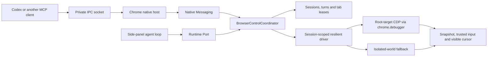

# Dual-client browser control

This is the operator and completion guide. The canonical component design,
protocol, lifecycle, security model, driver internals, cursor contract, and
extension points are documented in
[Browser-control architecture](BROWSER_CONTROL_ARCHITECTURE.md).

The extension has one browser-control authority with two clients:



The side-panel chat still owns its complete AI loop locally. MCP is an
additional client; it never has its own browser driver or a privileged
shortcut around the coordinator.

## Runtime contract

- Each client starts a browser session and a turn. Sessions have a resume token,
  own tab leases, and are orphaned on disconnect.
- CDP snapshots return opaque references bound to session, tab, and document
  revision. Actions with a stale reference fail safely and require a fresh
  snapshot.
- CDP is the primary engine and attaches directly to the page target ID rather
  than the tab wrapper. This isolates root-page control from unrelated extension
  surfaces as far as Chrome permits and keeps input trusted.
- Chrome can still forcibly detach `chrome.debugger` when a password manager or
  another extension opens its own frame. That browser session then switches to
  a session-local isolated-world driver, requires a fresh snapshot/reference
  epoch, and continues. A later client starts with CDP again.
- The cursor overlay is injected lazily into only the controlled tab and
  receives the resolved CDP input coordinate or the fallback driver's
  preliminary element center. The action waits briefly for visual arrival but
  never blocks forever on a hidden tab. Fallback alignment is best-effort when
  its later action injection scrolls or moves the element.
- CDP attachment explicitly restores Input-domain delivery and target focus.
  This keeps trusted pointer/key events reliable even when another Chrome
  window was previously frontmost.
- Every close-tab request creates an approval challenge. Only the side-panel
  approval port can approve or reject it; the originating client resumes the
  exact bound action afterwards. Target-label classification exists, but the
  current resilient driver wrapper does not forward its metadata, so those
  high-impact label challenges are not yet reliable.

## External MCP bridge

External control is enabled by default and can be disabled in **Settings →
External MCP control**. The bridge only becomes reachable after installing the
local companion, and uses no TCP listener:

1. Chrome starts the native host through `nativeMessaging`.
2. The host binds its private IPC endpoint, publishes a 0600 per-user registry
   entry with a random token, then acknowledges protocol readiness to the
   extension. The Darwin socket uses a short private `/tmp` directory to stay
   below macOS's AF_UNIX path limit; Windows uses a named pipe.
3. The MCP process discovers one healthy extension instance, authenticates over
   that private IPC channel, and forwards versioned protocol envelopes.

Disconnected hosts unregister immediately, so an extension reload does not
leave multiple healthy MCP instances during the heartbeat grace period.

Build and install the companion with the loaded extension’s ID:

```sh
pnpm --filter @ai-page-chat/browser-bridge build
node packages/browser-bridge/dist/cli.js install --extension-id nipfdolfnlajephejcgeiibaonaicmjl
```

The installer copies the self-contained compiled bridge bundle into a
user-scoped runtime, writes a Chrome native-host manifest restricted to that
exact extension origin, and creates a local MCP launcher. Its JSON output
contains the `mcp_servers` snippet to add to the MCP client configuration. It
deliberately does not implement an automatic uninstall/delete operation.

## Required permissions and validation

The loaded extension needs the Chrome `debugger` and `nativeMessaging`
permissions, plus host access for the page being controlled. `debugger` shows
Chrome’s normal debugging indicator while attached. The MCP toggle alone does
not grant page access or bypass confirmations.

Validation is layered:

1. `pnpm compile`, `pnpm test:unit`, and `pnpm build` validate the extension.
2. `pnpm --filter @ai-page-chat/browser-bridge compile|test|build` validates
   the native host, private IPC, and MCP package.
3. Start the dev bridge, WXT dev build, and `test/browser-control/bench-server.mjs`;
   run `node test/browser-control/run.mjs` against the real side panel.
4. With the companion installed and External MCP control enabled, use the MCP
   launcher’s generated config to call `browser_status`, claim a test tab,
   snapshot it, click/fill it, observe the cursor, and release/end the session.
   `node scripts/mcp-smoke.mjs` runs that flow through the official MCP SDK.

New embedded-agent sessions also enable browser control by default. Legacy
sessions are migrated once, while an explicit per-session opt-out is preserved.

## Completion checklist

The implementation is not considered complete until all of these gates pass
against the real unpacked extension:

- Repeated navigation, chat replacement, and debugger attach/detach transitions
  do not strand a lease or detach a replacement browser session.
- All five embedded-agent bench scenarios pass their hard checks with browser
  control enabled by the product default.
- The installed MCP companion can connect, claim, snapshot, click, fill, show
  the cursor at the resolved target, release, and disconnect without blocking a
  later embedded chat.
- `chrome://extensions` remains free of AI Page Chat errors after reload and
  browser-control use.
- Unit tests, TypeScript compilation, the production build, documentation, and
  the final implementation audit all pass.

The live completion run passed all five embedded scenarios (15 hard checks),
the installed MCP smoke flow including normal transport-close cleanup,
two-position cursor validation for both embedded and MCP clients, repeated MCP
fill replacement, fallback activation, and a clean `chrome://extensions` error
page after reload and exercised control. The run also verified that an MCP
client closed without `browser_end_session` releases its lease before embedded
control starts. The architecture guide records the stricter remaining limit for
uncatchable MCP termination and shared-native-connection loss.
